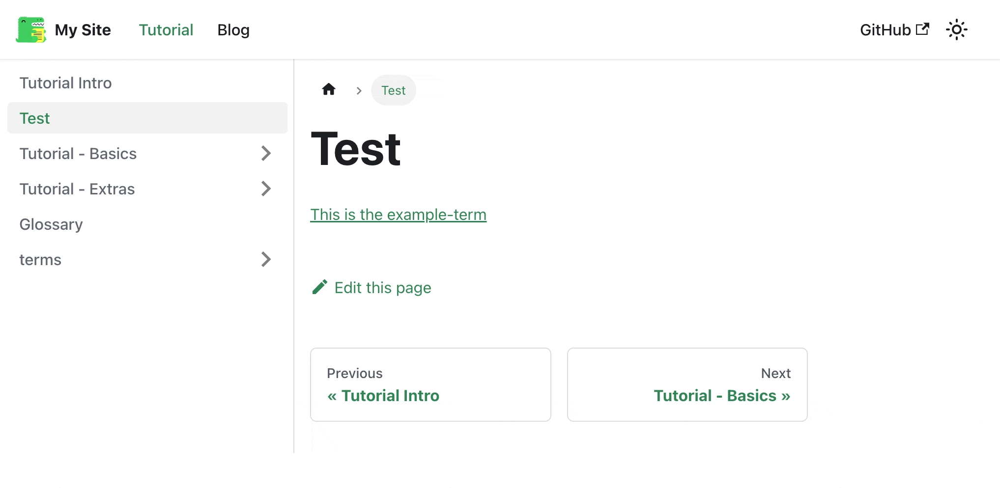

# @grnet/docusaurus-terminology

## Overview

This Docusaurus plugin allows you to use standout terms in your pages, which, when hovered over, displays a short explanation, and when clicked, navigates you to the relevant page. The plugin parses all `*.mdx` files and replaces each Markdown hyperlink pattern with a `<a>` HTML tag supporting a tooltip functionality. Additionally, it generates a glossary with all terms corresponding to the `*.mdx` files.



## How it works
This plugin retrieves docs in two ways:

1. Parses all `*.mdx` files in the `docs/` directory and replaces each pattern `[text](path)` (Markdown syntax for a hyperlink) with a `<a>` tag supporting tooltip functionality using the [@grnet/term-preview](https://www.npmjs.com/package/@grnet/docusaurus-term-preview) package that uses the [rc-tooltip](https://www.npmjs.com/package/rc-tooltip) under the hood.
2. Creates a glossary with all the terms from `*.mdx` files that are listed in the `docs/terms/`.

In greater depth:

#### Terms

The plugin needs the directory `docs/terms`, which contains all the terms you need for your website. The specific format for each term:

In `docs/terms/example-term.md`:

```
---
id: example-term
title: Example term
hoverText: This is an example term
---

Example body
```

where:

* `id`: the unique id of the docusaurus web page, this is docusaurus specific

* `title`: the visible title of the term, docusaurus specific as well

* `hoverText`: this text shows when you hover over a term in a documentation page

You can add your own content under the markdown metadata header.

#### Glossary

The plugin creates a glossary that aggregates all of the terms from the `docs/terms` directory onto a single page where you can examine each term and its `hoverText` definition. Also, you can click a term to go to the term page. To see the glossary page you can visit [http://localhost:3000/docs/glossary](http://localhost:3000/docs/glossary)

## Installation

To use this plugin, you have to add it to your project as a npm package. You can do this by running the following command in your project's root directory:

```
npm i @grnet/docusaurus-terminology --save
```

or

```
yarn add @grnet/docusaurus-terminology
```

Once the package is installed, you need to configure it in your Docusaurus site configuration file by adding the plugin to your `docusaurus.config.js` file:

```
module.exports = {
    ...
  plugins: [
    ['@grnet/docusaurus-terminology', {
      termsDir: './docs/terms',
      docsDir: './docs/',
      glossaryFilepath: './docs/glossary.md'
    }],
  ],
    ...
};
```

## Usage

To use the terminology tool, you need to create the terms folder under docs in order to have the required folder structure: `docs/terms`. After that you can create the `*.mdx` files and initialize them with the format of the following metadata header.

```
---
id: example-term
title: Example term
hoverText: This is an example term
---
```

You should also create a new `./docs/glossary.md` file.

```
---
id: glossary
title: Glossary
---

This is my glossary file, I expect this to remain unaltered, and just append text below this line.

```

To include the desired term in a documentation page, you can add the Markdown syntax for a hyperlink `[text](path)` in the page (eg `[This is the example-term](./docs/terms/example-term)`).

This renders the hyperlink "This is the example-term", and displays the "hoverText" attribute when you hover it.

## Troubleshooting

If you encounter any issues with the @grnet/docusaurus-terminology plugin, please check the following:
* Ensure that you have installed it correctly and added it to your site configuration file.
* Make sure that you add/edit `*.mdx` files under the `/docs/terms` directory and the hyperlink pattern `[text](path)` you are using to define the term is correct. Both the term's id and filename must match.
* If you are still encountering issues, please submit a bug report or contact the plugin maintainer for support.

## Contributing

If you would like to contribute to the development of the @grnet/docusaurus-terminology plugin, you can do so by submitting issues or pull requests on the GitHub repository.

## License

The @grnet/docusaurus-terminology plugin is released under the BSD-2-Clause.

